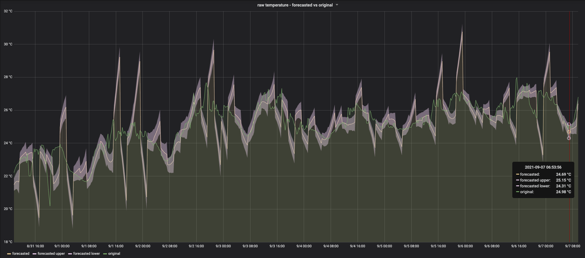

# reckon

[![Build Status][actions-badge]][actions-url]
[![MIT licensed][mit-badge]][mit-url]

[actions-badge]: https://github.com/waltzofpearls/reckon/workflows/ci/badge.svg
[actions-url]: https://github.com/waltzofpearls/reckon/actions?query=workflow%3Aci+branch%3Amain
[mit-badge]: https://img.shields.io/badge/license-MIT-green.svg
[mit-url]: https://github.com/waltzofpearls/reckon/blob/main/LICENSE

Reckon is a prometheus exporter for time series forecasting and anomaly detection. It scrapes prometheus metrics
with a defined time range, train a predictive model with those metrics, and then expose the original and forecasted
metrics back through a prometheus HTTP endpoint.

An exmaple of original and forecasted metrics generated from [Prophet](https://facebook.github.io/prophet/) and
exposed from reckon:

```
# HELP sensehat_humidity_prophet Prophet forecasted metric value
# TYPE sensehat_humidity_prophet gauge
sensehat_humidity_prophet{column="yhat",instance="sensehat.rpi.topbass.studio:8000",job="sensehat_exporter"} 60.491915201576944
sensehat_humidity_prophet{column="yhat_lower",instance="sensehat.rpi.topbass.studio:8000",job="sensehat_exporter"} 59.233345022648194
sensehat_humidity_prophet{column="yhat_upper",instance="sensehat.rpi.topbass.studio:8000",job="sensehat_exporter"} 61.69595781236965
# HELP sensehat_temperature_prophet Prophet forecasted metric value
# TYPE sensehat_temperature_prophet gauge
sensehat_temperature_prophet{column="yhat",instance="sensehat.rpi.topbass.studio:8000",job="sensehat_exporter"} 26.479665209525724
sensehat_temperature_prophet{column="yhat_lower",instance="sensehat.rpi.topbass.studio:8000",job="sensehat_exporter"} 26.17373164147707
sensehat_temperature_prophet{column="yhat_upper",instance="sensehat.rpi.topbass.studio:8000",job="sensehat_exporter"} 26.767488257211966
```

Each metric configured in reckon will have its forecasted metric generated and exported in 3 dimensions (labels):

- `yhat`: forecasted value
- `yhat_upper` and `yhat_lower`: [uncertainty interval](https://en.wikipedia.org/wiki/Confidence_interval)

<p align="center">
  
</p>

## Try it

Gather the following info before start:

- Prometheus server address, for example, `http://prometheus.rpi.topbass.studio:9090`
- Metric names to watch and models for each metric, accepts inline YAML or comma separated list,
  for example, `{sensehat_temperature: [Prophet], sensehat_humidity: [Prophet]}` or
  `sensehat_temperature,sensehat_humidity`

#### With Docker

This is the simplest method to get reckon running. You only need docker to get started.

```shell
PROM_CLIENT_URL={prometheus_server_address} \
WATCH_LIST={inline_yaml_or_comma_separated_list} \
make docker
```

#### With Go, Python and Virtualenv

If you prefer running reckon without docker, or you would like to build and run the binary locally, you will need
Go, Python and Virtualenv. Make sure you have Go 1.16+ and Python 3.7

- Go: `brew install go` or [follow this gudie](https://golang.org/doc/install)
- Pyenv: `brew install pyenv` or [follow this guide](https://github.com/pyenv/pyenv#installation)
- Python3.7
  - find a Python 3.7 version with `pyenv install -l | grep '^\s*3.7'`
  - select a version (eg. `3.7.12`) and install it with `pyenv install 3.7.12`
  - switch to the installed version `pyenv global 3.7.12`
- Virtualenvwrapper: `pip install virtualenvwrapper` AND [follow this guide](https://virtualenvwrapper.readthedocs.io/en/latest/install.html)

```shell
PROM_CLIENT_URL={prometheus_server_address} \
WATCH_LIST={inline_yaml_or_comma_separated_list} \
make run
```

## Configure it

Reckon can be configured with the following environment variables:

| Environment variable               | Required?   | Default value       | Description                                                                                             |
| ---------------------------------- | :---------: | ------------------- | ------------------------------------------------------------------------------------------------------- |
| `SCHEDULE`                         | Yes         | `@every 120m`       | schedule for model training                                                                             |
| `TIMEZONE`                         | Yes         | `America/Vancouver` | timezone for calculating schedule                                                                       |
| `WATCH_LIST`                       | Yes         |                     | metrics to scrape, YAML (model names specified on each metric) or comma separated list (needs `MODELS`) |
| `MODELS`                           | Yes         | `Prophet`           | ML models for training and forecasting, required if `WATCH_LIST` is a comma separated list              |
| `PROM_EXPORTER_ADDR`               | Yes         | `:8080`             | address for reckon to expose forecasted metrics                                                         |
| `PROM_CLIENT_URL`                  | Yes         |                     | reckon will scrape metrics from this URL                                                                |
| `PROM_CLIENT_TLS_CA`               | No          |                     | CA cert if `PROM_CLIENT_URL` is https                                                                   |
| `PROM_CLIENT_TLS_CERT`             | No          |                     | TLS cert if `PROM_CLIENT_URL` is https                                                                  |
| `PROM_CLIENT_TLS_KEY`              | No          |                     | TLS key if `PROM_CLIENT_URL` is https                                                                   |
| `PROM_CLIENT_INSECURE_SKIP_VERIFY` | No          |                     | skip TLS verification on `PROM_CLIENT_URL`                                                              |
| `DEFAULT_CHUNK_SIZE`               | Yes         | `120m`              | duration of original data to scrape                                                                     |
| `ROLLING_WINDOW`                   | Yes         | `72h`               | duration of original data to keep for training                                                          |
| `GRPC_SERVER_ADDRESS`              | Yes         | `localhost:18443`   | internal gRPC model server address                                                                      |
| `GRPC_ROOT_CA`                     | Yes         |                     | gRPC mTLS root CA                                                                                       |
| `GRPC_SERVER_CERT`                 | Yes         |                     | gRPC mTLS server cert                                                                                   |
| `GRPC_SERVER_KEY`                  | Yes         |                     | gRPC mTLS server cert key                                                                               |
| `GRPC_CLIENT_CERT`                 | Yes         |                     | gRPC mTLS client cert                                                                                   |
| `GRPC_CLIENT_KEY`                  | Yes         |                     | gRPC mTLS client cert key                                                                               |

## Use it

- Find [the latest release](https://github.com/waltzofpearls/reckon/releases) and downlaod a `.tar.gz` archive
  for your OS and architecture.
- Generate root CA, server and client keys and certificates for gRPC mTLS calls to Python ML models. Here is
  an example for [generating the keys and certs with certstrap](https://github.com/waltzofpearls/reckon/blob/main/Makefile#L70-L80).
- Deploy reckon to bare metal hosts. Here is [an example with ansible](https://github.com/waltzofpearls/rpi-ansible/blob/main/setup-reckon.yml).
- Alternatively, [build a debian slim based docker container](https://github.com/waltzofpearls/reckon/blob/main/Makefile#L97-L126),
  and deploy the container to kubernetes or other orchestration platforms.

## Monitor it

In addition to forecasted metrics, reckon also exposes runtime metrics to help monitor reckon itself.

| Metric                                         | Type    | Description                                                      |
| ---------------------------------------------- | ------- | ---------------------------------------------------------------- |
| `reckon_prometheus_client_scrape_time_seconds` | Gauge   | timestamp of the last prometheus client scrape                   |
| `reckon_exporter_scraped_time_seconds`         | Gauge   | timestamp of the last time reckon exporter scraped by prometheus |
| `reckon_model_train_time_seconds`              | Gauge   | timestamp of the last reckon model training                      |
| `reckon_forecast_data_received_time_seconds`   | Gauge   | timestamp of the last time receiving forecast data               |
| `reckon_model_train_total`                     | Counter | number of times calling model train                              |
| `reckon_model_train_duration_seconds`          | Gauge   | time taken in seconds from the last model training               |
| `reckon_model_train_errors_total`              | Counter | number of model training errors                                  |
| `reckon_prometheus_client_scrape_errors_total` | Counter | prometheus client scraping errors                                |
| `reckon_exporter_scraped_total`                | Counter | number of times reckon exporter scraped by prometheus            |
| `reckon_prometheus_client_scrape_total`        | Counter | number of prometheus client scrape                               |
| `reckon_data_scraped_duration_minutes`         | Gauge   | duration of data scraped from prometheus                         |
| `reckon_forecast_data_duration_minutes`        | Gauge   | duration of data being kept in memory                            |
| `reckon_training_data_duration_minutes`        | Gauge   | duration of data sent to model for training                      |
| `reckon_data_scraped_values`                   | Gauge   | number of the last scraped data points                           |
| `reckon_forecast_data_values`                  | Gauge   | number of the existing data points kept in memory                |
| `reckon_training_data_values`                  | Gauge   | number of data points recently sent to model for training        |
